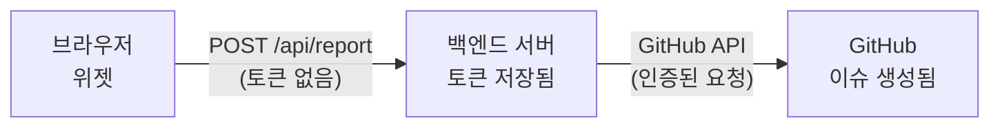

<p align="center">
  
</p>

<h1 align="center">inner-lens</h1>

<p align="center">
  <strong>Self-Debugging QA Agent</strong> — AI 분석 기능을 갖춘 유니버설 버그 리포팅 위젯
</p>

<p align="center">
  <a href="https://www.npmjs.com/package/inner-lens"></a>
  <a href="https://www.npmjs.com/package/inner-lens"></a>
  <a href="https://github.com/jhlee0409/inner-lens/actions/workflows/test.yml"></a>
  <a href="https://github.com/jhlee0409/inner-lens/blob/main/LICENSE"></a>
  <a href="https://github.com/jhlee0409/inner-lens"></a>
</p>

<p align="center">
  <a href="#빠른-시작">빠른 시작</a> &#8226;
  <a href="#왜-inner-lens인가">왜 inner-lens?</a> &#8226;
  <a href="#문서">문서</a> &#8226;
  <a href="https://github.com/jhlee0409/inner-lens/blob/main/CONTRIBUTING.md">기여하기</a>
</p>

<p align="center">
  <a href="./README.md">English</a> | <b>한국어</b>
</p>

---

## 왜 inner-lens인가?

*"안 돼요"* 같은 버그 리포트는 디버깅 시간을 수 시간씩 낭비하게 만듭니다. **inner-lens**는 개발자가 버그를 즉시 재현하고 수정하는 데 필요한 모든 것을 캡처합니다.

| inner-lens 없이 | inner-lens와 함께 |
|----------------|------------------|
| "버튼이 안 돼요" | 콘솔 로그, 네트워크 에러, DOM 상태, 세션 리플레이 |
| 몇 시간의 왔다갔다 | 원클릭 버그 리포트와 전체 컨텍스트 |
| 수동 로그 수집 | PII 마스킹이 적용된 자동 캡처 |
| 무슨 일이 있었는지 추측 | AI 기반 근본 원인 분석 |

### 작동 방식

```
사용자가 "버그 신고" 클릭 → 위젯이 컨텍스트 캡처 → GitHub Issue 생성 → AI가 분석하고 수정 제안
```

1. **캡처** — 콘솔 로그, 네트워크 에러, 사용자 액션, DOM 상태
2. **보호** — 민감한 데이터(이메일, 토큰, API 키)가 자동으로 마스킹됨
3. **리포트** — 구조화된 데이터로 GitHub 이슈 생성
4. **분석** — AI가 근본 원인을 찾고 코드 수정을 제안

---

## 기능

- **유니버설 프레임워크 지원** — React, Vue, vanilla JS (모든 프레임워크와 호환)
- **AI 기반 분석** — Claude, GPT, 또는 Gemini가 버그를 분석하고 수정 제안
- **자동 데이터 캡처** — 콘솔 로그, 네트워크 에러, 사용자 액션, DOM 상태
- **보안 우선** — PII, API 키, 토큰이 브라우저를 떠나기 전에 마스킹됨
- **세션 리플레이** — 시각적 버그 재현을 위한 선택적 DOM 녹화
- **다국어 지원** — 5개 언어 UI 지원 (EN, KO, JA, ZH, ES)
- **제로 설정** — 호스팅 API로 즉시 사용 가능
- **셀프 호스팅 가능** — 자체 백엔드로 완전한 제어

---

## 설정 방식 선택

| | Hosted (권장) | Self-Hosted |
|---|:---:|:---:|
| **설정 시간** | 2분 | 10분 |
| **백엔드 필요** | 아니오 | 예 |
| **이슈 작성자** | `inner-lens-app[bot]` | 본인 GitHub 계정 |
| **Rate Limit** | 10 req/min/IP | 없음 |
| **데이터 제어** | GitHub API 경유 | 완전 제어 |

**Hosted 선택:** 백엔드 코드 없이 가장 빠르게 시작하고 싶을 때.

**Self-Hosted 선택:** 커스텀 Rate Limit이 필요하거나, 본인 계정으로 이슈를 생성하거나, 완전한 데이터 제어가 필요할 때.

---

## 빠른 시작

```bash
npx inner-lens init
```

CLI가 모든 설정을 처리합니다:
- Hosted / Self-Hosted 모드 선택
- GitHub App 설치 (브라우저 자동 열기)
- 프레임워크 감지 (React, Vue, Next.js 등)
- 위젯 및 워크플로우 파일 생성

설정 후 `npm run dev` 실행하고 버그 버튼을 클릭하세요.

<details>
<summary><b>수동 설정 (CLI 없이)</b></summary>

### 1. 설치

```bash
npm install inner-lens
```

### 2. GitHub App 설치 (Hosted 모드)

[github.com/apps/inner-lens-app](https://github.com/apps/inner-lens-app)에서 리포지토리에 설치하세요.

### 3. 위젯 추가

**React / Next.js:**
```tsx
import { InnerLensWidget } from 'inner-lens/react';

export default function App() {
  return (
    <>
      <YourApp />
      <InnerLensWidget repository="your-org/your-repo" />
    </>
  );
}
```

**Vue 3:**
```vue
<script setup>
import { InnerLensWidget } from 'inner-lens/vue';
</script>

<template>
  <YourApp />
  <InnerLensWidget repository="your-org/your-repo" />
</template>
```

**Vanilla JS:**
```js
import { InnerLens } from 'inner-lens/vanilla';

const widget = new InnerLens({
  repository: 'your-org/your-repo',
});
widget.mount();
```

</details>

---

## 문서

### AI 분석 설정

GitHub Actions 워크플로우로 AI 기반 분석을 활성화하세요.

#### 옵션 A: CLI (권장)

```bash
npx inner-lens init
```

CLI가 수행하는 작업:
- Hosted 또는 Self-Hosted 모드 선택
- 프레임워크 자동 감지
- AI 제공자 및 모델 선택
- 워크플로우 파일과 위젯 코드 생성

#### 옵션 B: 수동 설정

`.github/workflows/inner-lens.yml` 생성:

```yaml
name: inner-lens Analysis

on:
  issues:
    types: [opened]

jobs:
  analyze:
    if: contains(github.event.issue.labels.*.name, 'inner-lens')
    uses: jhlee0409/inner-lens/.github/workflows/analysis-engine.yml@v1
    with:
      provider: 'anthropic'  # 또는 'openai', 'google'
      language: 'ko'
    secrets:
      ANTHROPIC_API_KEY: ${{ secrets.ANTHROPIC_API_KEY }}
```

**Settings → Secrets and variables → Actions**에서 API 키를 추가하세요.

### AI 제공자

| 제공자 | 기본 모델 | 시크릿 이름 |
|--------|----------|-------------|
| Anthropic | `claude-sonnet-4-5-20250929` | `ANTHROPIC_API_KEY` |
| OpenAI | `gpt-5.2` | `OPENAI_API_KEY` |
| Google | `gemini-2.5-flash` | `GOOGLE_GENERATIVE_AI_API_KEY` |

<details>
<summary><b>지원되는 모든 모델</b></summary>

**Anthropic Claude:**
- `claude-sonnet-4-5-20250929` (권장)
- `claude-opus-4-5-20251124`
- `claude-3-5-sonnet-20241022`
- `claude-3-5-haiku-20241022`

**OpenAI GPT:**
- GPT-5 시리즈: `gpt-5.2`, `gpt-5.2-pro`, `gpt-5`, `gpt-5-mini`, `gpt-5-nano`
- GPT-4.1 시리즈: `gpt-4.1`, `gpt-4.1-mini`, `gpt-4.1-nano`
- GPT-4o 시리즈: `gpt-4o`, `gpt-4o-mini`
- 추론 모델: `o3`, `o3-mini`, `o4-mini`

**Google Gemini:**
- Gemini 3 (프리뷰): `gemini-3-pro`, `gemini-3-flash`
- Gemini 2.5: `gemini-2.5-pro`, `gemini-2.5-flash`, `gemini-2.5-flash-lite`
- Gemini 2.0: `gemini-2.0-flash`, `gemini-2.0-flash-lite`

</details>

---

### 설정

#### 위젯 옵션

**모드별 옵션:**

| 옵션 | Hosted 모드 | Self-Hosted 모드 |
|------|-------------|------------------|
| `repository` | **필수** (`owner/repo`) | 선택 (백엔드에서 설정 가능) |
| `endpoint` | 불필요 (호스팅 API 사용) | **필수** (백엔드 URL) |

**공통 옵션:**

| 옵션 | 타입 | 기본값 | 설명 |
|------|------|--------|------|
| `language` | `string` | `en` | UI 언어 (`en`, `ko`, `ja`, `zh`, `es`) |
| `devOnly` | `boolean` | `true` | 프로덕션에서 숨기기 |
| `disabled` | `boolean` | `false` | 위젯 비활성화 |
| `position` | `string` | `bottom-right` | 버튼 위치 |
| `buttonColor` | `string` | `#6366f1` | 버튼 색상 |
| `buttonSize` | `string` | `lg` | 버튼 크기 (`sm`, `md`, `lg`) |

#### 고급 옵션

| 옵션 | 타입 | 기본값 | 설명 |
|------|------|--------|------|
| `labels` | `string[]` | `['inner-lens']` | GitHub 이슈 라벨 |
| `captureConsoleLogs` | `boolean` | `true` | 콘솔 로그 캡처 |
| `maxLogEntries` | `number` | `50` | 최대 로그 항목 수 |
| `maskSensitiveData` | `boolean` | `true` | PII 및 시크릿 자동 마스킹 |
| `captureUserActions` | `boolean` | `true` | 클릭/입력 캡처 |
| `captureNavigation` | `boolean` | `true` | 라우트 변경 캡처 |
| `capturePerformance` | `boolean` | `true` | Core Web Vitals 캡처 |
| `captureSessionReplay` | `boolean` | `false` | DOM 녹화 활성화 |

#### 텍스트 커스터마이징

| 옵션 | 타입 | 설명 |
|------|------|------|
| `buttonText` | `string` | 트리거 버튼 텍스트 |
| `dialogTitle` | `string` | 다이얼로그 헤더 텍스트 |
| `dialogDescription` | `string` | 설명 라벨 텍스트 |
| `submitText` | `string` | 제출 버튼 텍스트 |
| `cancelText` | `string` | 취소 버튼 텍스트 |
| `successMessage` | `string` | 성공 알림 텍스트 |

#### 콜백

```tsx
<InnerLensWidget
  repository="owner/repo"
  onOpen={() => console.log('다이얼로그 열림')}
  onClose={() => console.log('다이얼로그 닫힘')}
  onSuccess={(url) => console.log('이슈 생성됨:', url)}
  onError={(error) => console.error('에러:', error)}
/>
```

#### 프로덕션 사용

```tsx
// 프로덕션에서 활성화
<InnerLensWidget repository="owner/repo" devOnly={false} />
```

#### 커스텀 트리거 (React)

기본 플로팅 버튼을 커스텀 엘리먼트로 교체:

```tsx
<InnerLensWidget
  repository="owner/repo"
  trigger={<button className="my-button">버그 제보</button>}
/>
```

---

### 세션 리플레이

시각적 버그 재현을 위한 선택적 DOM 레벨 녹화.

#### 위젯에서 활성화

```tsx
<InnerLensWidget 
  repository="owner/repo"
  captureSessionReplay={true}
/>
```

끝! 위젯이 자동으로 마지막 60초의 DOM 활동을 캡처합니다.

#### 고급: 수동 제어

녹화를 세밀하게 제어하려면 replay API를 직접 사용하세요:

```ts
import { startSessionReplay, stopSessionReplay, getSessionReplaySnapshot } from 'inner-lens/replay';

// 커스텀 옵션으로 녹화 시작
await startSessionReplay({
  maxBufferDuration: 60000,  // 마지막 60초
  maskInputs: true,          // 모든 입력값 마스킹
  blockSelectors: ['.credit-card-form'],  // 민감한 요소 차단
  maskSelectors: ['.pii', '.user-email'], // 특정 요소 마스킹
});

// 버그 리포트용 스냅샷 가져오기
const replayData = getSessionReplaySnapshot();

// 녹화 종료
stopSessionReplay();
```

---

### 셀프 호스팅 모드

자체 백엔드로 완전한 제어. 이슈는 본인 GitHub 계정으로 생성됩니다.

#### 왜 백엔드가 필요한가요?

셀프 호스팅 모드에서 **백엔드 서버는 필수**입니다:

1. **토큰 보안** — GitHub Personal Access Token은 절대로 브라우저에 노출되면 안 됩니다. 클라이언트 코드에 포함되면 누구나 토큰을 추출해 리포지토리에 접근할 수 있습니다.

2. **서버 사이드 인증** — GitHub API 호출은 토큰이 안전하게 보관된 서버 환경에서 이루어져야 합니다.



위젯은 버그 리포트 데이터만 백엔드로 전송합니다. 백엔드가 토큰을 사용해 안전하게 GitHub API를 호출합니다.

#### Step 1: GitHub 토큰 발급

`repo` 스코프가 있는 [Personal Access Token](https://github.com/settings/tokens/new?scopes=repo)을 생성하세요.

#### Step 2: 백엔드 설정

<details open>
<summary><b>Next.js (App Router)</b></summary>

```ts
// app/api/inner-lens/report/route.ts
import { createFetchHandler } from 'inner-lens/server';

export const POST = createFetchHandler({
  githubToken: process.env.GITHUB_TOKEN!,
  repository: 'owner/repo',
});
```

```bash
# .env.local
GITHUB_TOKEN=ghp_xxxxxxxxxxxx
```
</details>

<details>
<summary><b>Express</b></summary>

```ts
import express from 'express';
import { createExpressHandler } from 'inner-lens/server';

const app = express();
app.use(express.json());

app.post('/api/inner-lens/report', createExpressHandler({
  githubToken: process.env.GITHUB_TOKEN!,
  repository: 'owner/repo',
}));

app.listen(3000);
```
</details>

<details>
<summary><b>Hono / Bun / Deno</b></summary>

```ts
import { Hono } from 'hono';
import { createFetchHandler } from 'inner-lens/server';

const app = new Hono();

app.post('/api/inner-lens/report', (c) => 
  createFetchHandler({
    githubToken: process.env.GITHUB_TOKEN!,
    repository: 'owner/repo',
  })(c.req.raw)
);

export default app;
```
</details>

<details>
<summary><b>더 많은 프레임워크...</b></summary>

**SvelteKit:**
```ts
// src/routes/api/inner-lens/report/+server.ts
import { json } from '@sveltejs/kit';
import { handleBugReport } from 'inner-lens/server';

export const POST = async ({ request }) => {
  const result = await handleBugReport(await request.json(), {
    githubToken: process.env.GITHUB_TOKEN!,
    repository: 'owner/repo',
  });
  return json(result.body, { status: result.status });
};
```

**Fastify:**
```ts
import Fastify from 'fastify';
import { createFastifyHandler } from 'inner-lens/server';

const fastify = Fastify();
fastify.post('/api/inner-lens/report', createFastifyHandler({
  githubToken: process.env.GITHUB_TOKEN!,
  repository: 'owner/repo',
}));
fastify.listen({ port: 3000 });
```

**Koa:**
```ts
import Koa from 'koa';
import Router from '@koa/router';
import bodyParser from 'koa-bodyparser';
import { createKoaHandler } from 'inner-lens/server';

const app = new Koa();
const router = new Router();
app.use(bodyParser());

router.post('/api/inner-lens/report', createKoaHandler({
  githubToken: process.env.GITHUB_TOKEN!,
  repository: 'owner/repo',
}));

app.use(router.routes());
app.listen(3000);
```

**Node.js HTTP:**
```ts
import http from 'http';
import { createNodeHandler } from 'inner-lens/server';

const handler = createNodeHandler({
  githubToken: process.env.GITHUB_TOKEN!,
  repository: 'owner/repo',
});

http.createServer(async (req, res) => {
  if (req.url === '/api/inner-lens/report' && req.method === 'POST') {
    await handler(req, res);
  }
}).listen(3000);
```

**Cloudflare Workers:**
```ts
import { createFetchHandler } from 'inner-lens/server';

export default {
  async fetch(request: Request, env: { GITHUB_TOKEN: string }) {
    const handler = createFetchHandler({
      githubToken: env.GITHUB_TOKEN,
      repository: 'owner/repo',
    });
    return handler(request);
  },
};
```

</details>

#### Step 3: 위젯 설정

위젯이 백엔드 엔드포인트를 가리키도록 설정:

```tsx
<InnerLensWidget
  endpoint="/api/inner-lens/report"  // 백엔드 URL
  repository="owner/repo"
/>
```

> **참고:** 셀프 호스팅 모드에서는 백엔드에 repository를 하드코딩했다면 위젯의 `repository`는 선택사항입니다.

---

### 보안

민감한 데이터는 전송 전에 자동으로 마스킹됩니다:

| 패턴 | 대체값 |
|------|--------|
| 이메일 주소 | `[EMAIL_REDACTED]` |
| API 키 (OpenAI, Stripe 등) | `[OPENAI_KEY_REDACTED]` |
| Bearer 토큰 | `Bearer [TOKEN_REDACTED]` |
| JWT | `[JWT_REDACTED]` |
| 신용카드 번호 | `[CARD_REDACTED]` |
| SSN | `[SSN_REDACTED]` |
| 전화번호 | `[PHONE_REDACTED]` |

---

## API 레퍼런스

### 클라이언트 패키지

| 패키지 | Exports | 설명 |
|--------|---------|------|
| `inner-lens/react` | `InnerLensWidget`, `useInnerLens` | React 컴포넌트와 훅 |
| `inner-lens/vue` | `InnerLensWidget`, `useInnerLens` | Vue 컴포넌트와 컴포저블 |
| `inner-lens/vanilla` | `InnerLens` | Vanilla JS 클래스 |
| `inner-lens/replay` | `startSessionReplay`, `stopSessionReplay`, `getSessionReplaySnapshot` | 세션 녹화 |

### 서버 핸들러

| Export | 프레임워크 |
|--------|-----------|
| `createFetchHandler` | Next.js, Hono, Bun, Deno, Cloudflare Workers |
| `createExpressHandler` | Express |
| `createFastifyHandler` | Fastify |
| `createKoaHandler` | Koa |
| `createNodeHandler` | Node.js HTTP |
| `handleBugReport` | 모든 프레임워크 (raw handler) |

---

## 문제 해결

<details>
<summary><b>위젯이 나타나지 않음</b></summary>

1. `disabled`와 `devOnly` props 확인
2. import 경로가 프레임워크와 맞는지 확인
3. 브라우저 콘솔에서 에러 확인
</details>

<details>
<summary><b>버그 리포트 실패</b></summary>

1. 엔드포인트 URL이 올바른지 확인
2. hosted 모드: GitHub App이 설치되어 있는지 확인
3. self-hosted: `GITHUB_TOKEN`이 `repo` 스코프를 가지고 있는지 확인
</details>

<details>
<summary><b>AI 분석이 실행되지 않음</b></summary>

1. `.github/workflows/`에 워크플로우 파일이 있는지 확인
2. 리포지토리 시크릿에 API 키가 설정되어 있는지 확인
3. 이슈에 `inner-lens` 라벨이 있는지 확인
</details>

---

## FAQ

<details>
<summary><b>Hosted vs Self-Hosted: 어떤 걸 선택해야 하나요?</b></summary>

| 항목 | Hosted | Self-Hosted |
|------|--------|-------------|
| 설정 시간 | 2분 | 10분 |
| 백엔드 코드 | 없음 | 필요 |
| 이슈 작성자 | `inner-lens-app[bot]` | 본인 GitHub 계정 |
| Rate limit | 10 req/min/IP | 없음 |
| GitHub 토큰 | 불필요 | 필요 (PAT) |

**Hosted 선택 시:**
- 가장 빠른 설정을 원할 때
- 봇 계정으로 이슈가 생성되어도 괜찮을 때
- 커스텀 Rate limit이 필요 없을 때

**Self-Hosted 선택 시:**
- 본인 계정으로 이슈를 생성하고 싶을 때
- 무제한 제출이 필요할 때
- 백엔드에 대한 완전한 제어가 필요할 때
</details>

<details>
<summary><b>GitHub 이슈는 누가 만드나요?</b></summary>

- **Hosted 모드:** `inner-lens-app[bot]`이 이슈를 생성합니다
- **Self-hosted 모드:** Personal Access Token을 소유한 GitHub 계정으로 이슈가 생성됩니다

팀 워크플로우와 이슈 트래킹에서 중요한 고려사항입니다.
</details>

<details>
<summary><b>SSR과 호환되나요?</b></summary>

네. 위젯은 클라이언트 사이드에서만 렌더링됩니다. Next.js에서는 `'use client'` 또는 dynamic import를 사용하세요.
</details>

<details>
<summary><b>어떤 AI 제공자가 가장 좋나요?</b></summary>

| 제공자 | 적합한 용도 |
|--------|-----------|
| Anthropic | 코드 이해, 정확도 |
| OpenAI | 속도, 범용 |
| Google | 비용 효율성 |
</details>

<details>
<summary><b>내 데이터는 안전한가요?</b></summary>

- 민감한 데이터는 브라우저를 떠나기 **전에** 마스킹됩니다
- 우리 서버에 데이터가 저장되지 않습니다 (hosted 모드는 GitHub API를 직접 사용)
- Self-hosted 모드는 완전한 제어를 제공합니다
</details>

<details>
<summary><b>나중에 Hosted에서 Self-Hosted로 전환할 수 있나요?</b></summary>

네! 간단히:
1. 백엔드를 설정합니다 ([셀프 호스팅 모드](#셀프-호스팅-모드) 참조)
2. 위젯에 `endpoint` prop을 추가합니다
3. 리포지토리에서 GitHub App을 제거합니다 (선택사항)

기존 이슈는 변경되지 않습니다.
</details>

---

## 기여하기

기여를 환영합니다! PR을 제출하기 전에 [기여 가이드](CONTRIBUTING.md)를 읽어주세요.

어디서 시작할지 모르겠다면 [`good first issue`](https://github.com/jhlee0409/inner-lens/labels/good%20first%20issue) 라벨이 붙은 이슈를 확인해보세요.

---

## 지원

- **버그 리포트**: [GitHub Issues](https://github.com/jhlee0409/inner-lens/issues)
- **기능 요청**: [GitHub Discussions](https://github.com/jhlee0409/inner-lens/discussions)

---

## 라이선스

[MIT License](LICENSE) © 2025 [jack](https://github.com/jhlee0409)

---

<p align="center">
  Made with &#10084;&#65039; by <a href="https://github.com/jhlee0409">jack</a>
</p>
