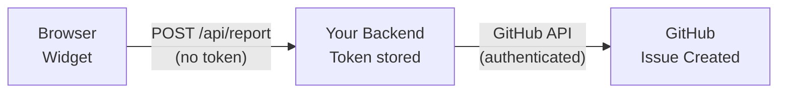

<p align="center">
  
</p>

<h1 align="center">inner-lens</h1>

<p align="center">
  <strong>Self-Debugging QA Agent</strong> — Universal bug reporting widget with AI-powered analysis
</p>

<p align="center">
  <a href="https://www.npmjs.com/package/inner-lens"></a>
  <a href="https://www.npmjs.com/package/inner-lens"></a>
  <a href="https://github.com/jhlee0409/inner-lens/actions/workflows/test.yml"></a>
  <a href="https://github.com/jhlee0409/inner-lens/blob/main/LICENSE"></a>
  <a href="https://github.com/jhlee0409/inner-lens"></a>
</p>

<p align="center">
  <a href="https://github.com/jhlee0409/inner-lens#quick-start">Quick Start</a> &#8226;
  <a href="https://github.com/jhlee0409/inner-lens#why-inner-lens">Why inner-lens?</a> &#8226;
  <a href="https://github.com/jhlee0409/inner-lens#documentation">Docs</a> &#8226;
  <a href="https://github.com/jhlee0409/inner-lens/blob/main/CONTRIBUTING.md">Contributing</a>
</p>

<p align="center">
  <b>English</b> | <a href="./README.ko.md">한국어</a>
</p>

---

<!-- 
<p align="center">
  
</p>
-->

## Why inner-lens?

Bug reports like *"it doesn't work"* waste hours of debugging time. **inner-lens** captures everything developers need to reproduce and fix bugs instantly.

| Without inner-lens | With inner-lens |
|-------------------|-----------------|
| "The button doesn't work" | Console logs, network errors, DOM state, session replay |
| Hours of back-and-forth | One-click bug reports with full context |
| Manual log collection | Automatic capture with PII masking |
| Guessing what happened | AI-powered root cause analysis |

### How It Works

```
User clicks "Report Bug" → Widget captures context → GitHub Issue created → AI analyzes and suggests fixes
```

1. **Capture** — Console logs, network errors, user actions, DOM state
2. **Protect** — Sensitive data (emails, tokens, API keys) masked automatically
3. **Report** — GitHub issue created with structured data
4. **Analyze** — AI finds root cause and suggests code fixes

---

## Features

- **Universal Framework Support** — React, Vue, vanilla JS (works with any framework)
- **AI-Powered Analysis** — Claude, GPT, or Gemini analyzes bugs and suggests fixes
- **Automatic Data Capture** — Console logs, network errors, user actions, DOM state
- **Security-First** — PII, API keys, and tokens masked before leaving the browser
- **Session Replay** — Optional DOM recording for visual bug reproduction
- **Multi-Language** — Widget UI in 5 languages (EN, KO, JA, ZH, ES)
- **Zero Config** — Works out of the box with hosted API
- **Self-Hostable** — Full control with your own backend

---

## Choose Your Setup

| | Hosted (Recommended) | Self-Hosted |
|---|:---:|:---:|
| **Setup Time** | 2 minutes | 10 minutes |
| **Backend Required** | No | Yes |
| **Issue Author** | `inner-lens-app[bot]` | Your GitHub account |
| **Rate Limit** | 10 req/min/IP | None |
| **Data Control** | Via GitHub API | Full control |

**Choose Hosted if:** You want the fastest setup with zero backend code.

**Choose Self-Hosted if:** You need custom rate limits, want issues created under your account, or require full data control.

---

## Quick Start

```bash
npx inner-lens init
```

The CLI handles everything:
- Hosted / Self-Hosted mode selection
- GitHub App installation (opens browser automatically)
- Framework detection (React, Vue, Next.js, etc.)
- Widget and workflow file generation

After setup, run `npm run dev` and click the bug button.

<details>
<summary><b>Manual Setup (without CLI)</b></summary>

### 1. Install

```bash
npm install inner-lens
```

### 2. Install GitHub App (Hosted Mode)

Visit [github.com/apps/inner-lens-app](https://github.com/apps/inner-lens-app) and install on your repository.

### 3. Add Widget

**React / Next.js:**
```tsx
import { InnerLensWidget } from 'inner-lens/react';

export default function App() {
  return (
    <>
      <YourApp />
      <InnerLensWidget repository="your-org/your-repo" />
    </>
  );
}
```

**Vue 3:**
```vue
<script setup>
import { InnerLensWidget } from 'inner-lens/vue';
</script>

<template>
  <YourApp />
  <InnerLensWidget repository="your-org/your-repo" />
</template>
```

**Vanilla JS:**
```js
import { InnerLens } from 'inner-lens/vanilla';

const widget = new InnerLens({
  repository: 'your-org/your-repo',
});
widget.mount();
```

</details>

---

## Documentation

### AI Analysis Setup

Enable AI-powered analysis with a GitHub Actions workflow.

#### Option A: CLI (Recommended)

```bash
npx inner-lens init
```

The CLI will:
- Choose Hosted or Self-Hosted mode
- Auto-detect your framework
- Select AI provider and model
- Generate workflow file and widget code

#### Option B: Manual Setup

Create `.github/workflows/inner-lens.yml`:

```yaml
name: inner-lens Analysis

on:
  issues:
    types: [opened]

jobs:
  analyze:
    if: contains(github.event.issue.labels.*.name, 'inner-lens')
    uses: jhlee0409/inner-lens/.github/workflows/analysis-engine.yml@v1
    with:
      provider: 'anthropic'  # or 'openai', 'google'
      language: 'en'         # en, ko, ja, zh, es, de, fr, pt
    secrets:
      ANTHROPIC_API_KEY: ${{ secrets.ANTHROPIC_API_KEY }}
```

Add your API key to **Settings → Secrets and variables → Actions**.

> **Note:** The `language` option controls the AI analysis output language (8 languages supported). This is separate from the widget UI language.

### AI Providers

| Provider | Default Model | Secret Name |
|----------|---------------|-------------|
| Anthropic | `claude-sonnet-4-5-20250929` | `ANTHROPIC_API_KEY` |
| OpenAI | `gpt-5.2` | `OPENAI_API_KEY` |
| Google | `gemini-2.5-flash` | `GOOGLE_GENERATIVE_AI_API_KEY` |

<details>
<summary><b>All Supported Models</b></summary>

**Anthropic Claude:**
- `claude-sonnet-4-5-20250929` (recommended)
- `claude-opus-4-5-20251124`
- `claude-3-5-sonnet-20241022`
- `claude-3-5-haiku-20241022`

**OpenAI GPT:**
- GPT-5 series: `gpt-5.2`, `gpt-5.2-pro`, `gpt-5`, `gpt-5-mini`, `gpt-5-nano`
- GPT-4.1 series: `gpt-4.1`, `gpt-4.1-mini`, `gpt-4.1-nano`
- GPT-4o series: `gpt-4o`, `gpt-4o-mini`
- Reasoning: `o3`, `o3-mini`, `o4-mini`

**Google Gemini:**
- Gemini 3 (preview): `gemini-3-pro`, `gemini-3-flash`
- Gemini 2.5: `gemini-2.5-pro`, `gemini-2.5-flash`, `gemini-2.5-flash-lite`
- Gemini 2.0: `gemini-2.0-flash`, `gemini-2.0-flash-lite`

</details>

---

### Configuration

#### Widget Options

**Mode-specific options:**

| Option | Hosted Mode | Self-Hosted Mode |
|--------|-------------|------------------|
| `repository` | **Required** (`owner/repo`) | Optional (can be set in backend) |
| `endpoint` | Not needed (uses hosted API) | **Required** (your backend URL) |

**Common options:**

| Option | Type | Default | Description |
|--------|------|---------|-------------|
| `language` | `string` | `en` | UI language (`en`, `ko`, `ja`, `zh`, `es`) |
| `devOnly` | `boolean` | `true` | Hide in production |
| `disabled` | `boolean` | `false` | Disable widget |
| `position` | `string` | `bottom-right` | Button position |
| `buttonColor` | `string` | `#6366f1` | Button color |
| `buttonSize` | `string` | `lg` | Button size (`sm`, `md`, `lg`) |

#### Advanced Options

| Option | Type | Default | Description |
|--------|------|---------|-------------|
| `labels` | `string[]` | `['inner-lens']` | GitHub issue labels |
| `captureConsoleLogs` | `boolean` | `true` | Capture console logs |
| `maxLogEntries` | `number` | `50` | Max log entries to capture |
| `maskSensitiveData` | `boolean` | `true` | Auto-mask PII and secrets |
| `captureUserActions` | `boolean` | `true` | Capture clicks/inputs |
| `captureNavigation` | `boolean` | `true` | Capture route changes |
| `capturePerformance` | `boolean` | `true` | Capture Core Web Vitals |
| `captureSessionReplay` | `boolean` | `false` | Enable DOM recording |

#### Text Customization

| Option | Type | Description |
|--------|------|-------------|
| `buttonText` | `string` | Trigger button text |
| `dialogTitle` | `string` | Dialog header text |
| `dialogDescription` | `string` | Description label text |
| `submitText` | `string` | Submit button text |
| `cancelText` | `string` | Cancel button text |
| `successMessage` | `string` | Success notification text |

#### Callbacks

```tsx
<InnerLensWidget
  repository="owner/repo"
  onOpen={() => console.log('Dialog opened')}
  onClose={() => console.log('Dialog closed')}
  onSuccess={(url) => console.log('Issue created:', url)}
  onError={(error) => console.error('Error:', error)}
/>
```

#### Production Usage

```tsx
// Enable in production
<InnerLensWidget repository="owner/repo" devOnly={false} />
```

#### Custom Trigger (React)

Replace the default floating button with your own element:

```tsx
<InnerLensWidget
  repository="owner/repo"
  trigger={<button className="my-button">Report Bug</button>}
/>
```

---

### Session Replay

Optional DOM-level recording for visual bug reproduction.

#### Enable via Widget

```tsx
<InnerLensWidget 
  repository="owner/repo"
  captureSessionReplay={true}
/>
```

That's it! The widget automatically captures the last 60 seconds of DOM activity.

#### Advanced: Manual Control

For more control over recording, use the replay API directly:

```ts
import { startSessionReplay, stopSessionReplay, getSessionReplaySnapshot } from 'inner-lens/replay';

// Start recording with custom options
await startSessionReplay({
  maxBufferDuration: 60000,  // Last 60 seconds
  maskInputs: true,          // Mask all input values
  blockSelectors: ['.credit-card-form'],  // Block sensitive elements
  maskSelectors: ['.pii', '.user-email'], // Mask specific elements
});

// Get snapshot for bug report
const replayData = getSessionReplaySnapshot();

// Stop recording when done
stopSessionReplay();
```

---

### Self-Hosted Mode

Full control with your own backend. Issues are created under your GitHub account.

#### Why Backend is Required

In self-hosted mode, **a backend server is mandatory** because:

1. **Token Security** — Your GitHub Personal Access Token must never be exposed to the browser. If embedded in client-side code, anyone could extract it and access your repositories.

2. **Server-Side Authentication** — GitHub API calls must be made from a secure server environment where tokens remain private.



The widget only sends bug report data to your backend. Your backend then securely calls GitHub API with the token.

#### Step 1: Get GitHub Token

Create a [Personal Access Token](https://github.com/settings/tokens/new?scopes=repo) with `repo` scope.

#### Step 2: Set Up Backend

<details open>
<summary><b>Next.js (App Router)</b></summary>

```ts
// app/api/inner-lens/report/route.ts
import { createFetchHandler } from 'inner-lens/server';

export const POST = createFetchHandler({
  githubToken: process.env.GITHUB_TOKEN!,
  repository: 'owner/repo',
});
```

```bash
# .env.local
GITHUB_TOKEN=ghp_xxxxxxxxxxxx
```
</details>

<details>
<summary><b>Express</b></summary>

```ts
import express from 'express';
import { createExpressHandler } from 'inner-lens/server';

const app = express();
app.use(express.json());

app.post('/api/inner-lens/report', createExpressHandler({
  githubToken: process.env.GITHUB_TOKEN!,
  repository: 'owner/repo',
}));

app.listen(3000);
```
</details>

<details>
<summary><b>Hono / Bun / Deno</b></summary>

```ts
import { Hono } from 'hono';
import { createFetchHandler } from 'inner-lens/server';

const app = new Hono();

app.post('/api/inner-lens/report', (c) => 
  createFetchHandler({
    githubToken: process.env.GITHUB_TOKEN!,
    repository: 'owner/repo',
  })(c.req.raw)
);

export default app;
```
</details>

<details>
<summary><b>More frameworks...</b></summary>

**SvelteKit:**
```ts
// src/routes/api/inner-lens/report/+server.ts
import { json } from '@sveltejs/kit';
import { handleBugReport } from 'inner-lens/server';

export const POST = async ({ request }) => {
  const result = await handleBugReport(await request.json(), {
    githubToken: process.env.GITHUB_TOKEN!,
    repository: 'owner/repo',
  });
  return json(result.body, { status: result.status });
};
```

**Fastify:**
```ts
import Fastify from 'fastify';
import { createFastifyHandler } from 'inner-lens/server';

const fastify = Fastify();
fastify.post('/api/inner-lens/report', createFastifyHandler({
  githubToken: process.env.GITHUB_TOKEN!,
  repository: 'owner/repo',
}));
fastify.listen({ port: 3000 });
```

**Koa:**
```ts
import Koa from 'koa';
import Router from '@koa/router';
import bodyParser from 'koa-bodyparser';
import { createKoaHandler } from 'inner-lens/server';

const app = new Koa();
const router = new Router();
app.use(bodyParser());

router.post('/api/inner-lens/report', createKoaHandler({
  githubToken: process.env.GITHUB_TOKEN!,
  repository: 'owner/repo',
}));

app.use(router.routes());
app.listen(3000);
```

**Node.js HTTP:**
```ts
import http from 'http';
import { createNodeHandler } from 'inner-lens/server';

const handler = createNodeHandler({
  githubToken: process.env.GITHUB_TOKEN!,
  repository: 'owner/repo',
});

http.createServer(async (req, res) => {
  if (req.url === '/api/inner-lens/report' && req.method === 'POST') {
    await handler(req, res);
  }
}).listen(3000);
```

**Cloudflare Workers:**
```ts
import { createFetchHandler } from 'inner-lens/server';

export default {
  async fetch(request: Request, env: { GITHUB_TOKEN: string }) {
    const handler = createFetchHandler({
      githubToken: env.GITHUB_TOKEN,
      repository: 'owner/repo',
    });
    return handler(request);
  },
};
```

</details>

#### Step 3: Configure Widget

Point the widget to your backend endpoint:

```tsx
<InnerLensWidget
  endpoint="/api/inner-lens/report"  // Your backend URL
  repository="owner/repo"
/>
```

> **Note:** In self-hosted mode, `repository` in the widget is optional if you hardcode it in your backend config.

---

### Security

Sensitive data is automatically masked before transmission:

| Pattern | Replacement |
|---------|-------------|
| Email addresses | `[EMAIL_REDACTED]` |
| API keys (OpenAI, Stripe, etc.) | `[OPENAI_KEY_REDACTED]` |
| Bearer tokens | `Bearer [TOKEN_REDACTED]` |
| JWTs | `[JWT_REDACTED]` |
| Credit card numbers | `[CARD_REDACTED]` |
| SSN | `[SSN_REDACTED]` |
| Phone numbers | `[PHONE_REDACTED]` |

---

## API Reference

### Client Packages

| Package | Exports | Description |
|---------|---------|-------------|
| `inner-lens/react` | `InnerLensWidget`, `useInnerLens` | React component and hook |
| `inner-lens/vue` | `InnerLensWidget`, `useInnerLens` | Vue component and composable |
| `inner-lens/vanilla` | `InnerLens` | Vanilla JS class |
| `inner-lens/replay` | `startSessionReplay`, `stopSessionReplay`, `getSessionReplaySnapshot` | Session recording |

### Server Handlers

| Export | Frameworks |
|--------|------------|
| `createFetchHandler` | Next.js, Hono, Bun, Deno, Cloudflare Workers |
| `createExpressHandler` | Express |
| `createFastifyHandler` | Fastify |
| `createKoaHandler` | Koa |
| `createNodeHandler` | Node.js HTTP |
| `handleBugReport` | Any (raw handler) |

---

## Troubleshooting

<details>
<summary><b>Widget doesn't appear</b></summary>

1. Check `disabled` and `devOnly` props
2. Verify import path matches your framework
3. Check browser console for errors
</details>

<details>
<summary><b>Bug report fails</b></summary>

1. Verify endpoint URL is correct
2. For hosted mode: ensure GitHub App is installed
3. For self-hosted: check `GITHUB_TOKEN` has `repo` scope
</details>

<details>
<summary><b>AI analysis not running</b></summary>

1. Verify workflow file exists at `.github/workflows/`
2. Check API key is set in repository secrets
3. Ensure issue has `inner-lens` label
</details>

---

## FAQ

<details>
<summary><b>Hosted vs Self-Hosted: Which should I choose?</b></summary>

| Aspect | Hosted | Self-Hosted |
|--------|--------|-------------|
| Setup time | 2 minutes | 10 minutes |
| Backend code | None | Required |
| Issue author | `inner-lens-app[bot]` | Your GitHub account |
| Rate limit | 10 req/min/IP | None |
| GitHub token | Not needed | Required (PAT) |

**Choose Hosted if:**
- You want the fastest setup
- You're okay with issues from a bot account
- You don't need custom rate limits

**Choose Self-Hosted if:**
- You want issues created under your account
- You need unlimited submissions
- You want full control over the backend
</details>

<details>
<summary><b>Who creates the GitHub issues?</b></summary>

- **Hosted mode:** Issues are created by `inner-lens-app[bot]`
- **Self-hosted mode:** Issues are created by the GitHub account that owns the Personal Access Token

This is an important consideration for team workflows and issue tracking.
</details>

<details>
<summary><b>Does it work with SSR?</b></summary>

Yes. The widget renders client-side only. For Next.js, use `'use client'` or dynamic import.
</details>

<details>
<summary><b>Which AI provider is best?</b></summary>

| Provider | Best For |
|----------|----------|
| Anthropic | Code understanding, accuracy |
| OpenAI | Speed, general purpose |
| Google | Cost efficiency |
</details>

<details>
<summary><b>Is my data safe?</b></summary>

- Sensitive data is masked **before** leaving the browser
- No data is stored on our servers (hosted mode uses GitHub API directly)
- Self-hosted mode gives you full control
</details>

<details>
<summary><b>Can I switch from Hosted to Self-Hosted later?</b></summary>

Yes! Simply:
1. Set up your backend (see [Self-Hosted Mode](#self-hosted-mode))
2. Add `endpoint` prop to your widget
3. Remove the GitHub App from your repository (optional)

Your existing issues will remain unchanged.
</details>

---

## Contributing

Contributions are welcome! Please read our [Contributing Guide](CONTRIBUTING.md) before submitting a Pull Request.

Looking for a place to start? Check out issues labeled [`good first issue`](https://github.com/jhlee0409/inner-lens/labels/good%20first%20issue).

---

## Support

- **Bug reports**: [GitHub Issues](https://github.com/jhlee0409/inner-lens/issues)
- **Feature requests**: [GitHub Discussions](https://github.com/jhlee0409/inner-lens/discussions)

---

## License

[MIT License](LICENSE) © 2025 [jack](https://github.com/jhlee0409)

---

<p align="center">
  Made with &#10084;&#65039; by <a href="https://github.com/jhlee0409">jack</a>
</p>
